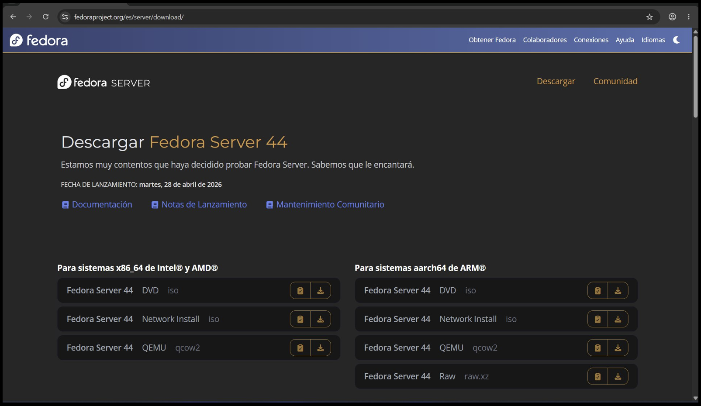
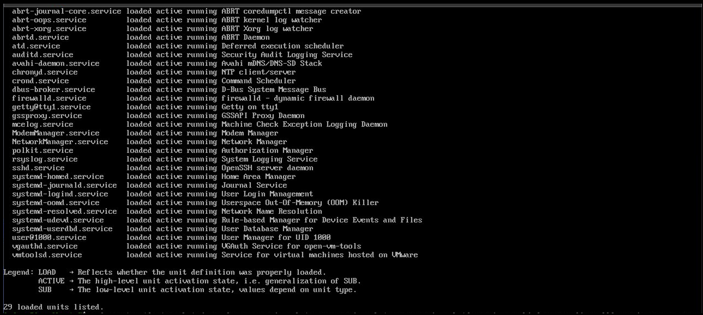

## HARDENING BÁSICO DE UN SISTEMA OPERATIVO LINUX (FEDORA SERVER44)

#### Descarga e instalación
Primero se tiene que descargar el sistema operativo a instalar, en este caso fue la ISO de
Fedora Server 44

#### Actualización
Una vez descargada e instalada (en hardware real o en una máquina virtual), lo primero que se
realiza es una actualización del sistema con el comando sudo dnf update-y, para tener los
paquetes mas recientes asegurando que estos tengan los parches de seguridad que sus
versiones anteriores probablemente no tendrían.

#### Detener y deshabilitar servicios
Una vez actualizado el sistema, se realiza un escaneo de los servicios que se están
ejecutando, utilizando el comando systemctl list-units —type=service —state=running
dando una salida similar a la que se muestra en pantalla:

Lo siguiente es identificar que servicios se van a estar utilizando y cuales no son
indispensables, por ejemplo, SSH se va a utilizar para conexiones remotas, al igual que
auditd.service que se usara para capturar cambios en el sistema operativo. Si se tuviera telnet,
se desactivaria pues es inseguro y SSH ya cumple su función, firewalld.service se va a
desabilitar tambien debido a que se sustituira por otro software.
En la imagen se muestran los servicios que se van a detener y deshabilitar:

####  Servicios ya deshabilitados
Despues de ejecutar los comandos anteriores, se utiliza nuevamente systemctl list-units —
type=service —state=running para verificar que ya no se esten ejecutando los servicios
detenidos y deshabilitados:

#### Ver puertos utilizados
También se pueden verificar que puertos estan utilizando los servicios que se están ejecutando
con el comando sudo ss-tulpn

#### Instalar iptables
Para sustituir al firewall que se desactivó, se va a utilizar iptables, un software que funciona
mediante reglas establecidas para filtar el tráfico que interactuará con el servidor, se utiliza el
comando sudo dnf install iptables-services para instalarlo:

#### Establescer políticas a iptables
Las políticas son las reglas que se le indican a iptables para determinar cómo manejará el
tráfico en INPUT, OUTPUT y FORWARD, que son conocidas como cadenas.
Las politicas a establecer son las que se muestran en la imagen, que indican con DROP que
van a descartar todas las entradas y reenvíos que se dirigen o pasan por el servidor, y con
ACCEPT indica que permitirá el tráfico, en este caso, saliente del servidor, para poder tener
conexión a internet.
sudo iptables–P INPUT DROP
sudo iptables–P FORWARD DROP
sudo iptables–P OUTPUT ACCEPT

Con el comando sudo iptables–L se pueden verificar las políticas establecidas

#### Permitir conexiones de loopback
Como DROP ha estado bloqueando todo lo que se dirige a INPUT, ni siquiera las conexiones
de loopback funcionaran, por lo que es necesario especificar con politicas que se permitirá el
acceso, haciendo uso del comando sudo iptables–A INPUT–i lo–j ACCEPT

#### Permitir conexiones ya establecidas
También se pueden permitir algunas conexiones que ya estaban establecidas para poder tener
comunicación, con el comando sudo ip tables–A INPUT–m state —state
ESTABLISHED,RELATED–j ACCEPT

#### Permitir puertos específicos
Se pueden establecer reglas para permitir conexiones a puertos específicos como en el caso
de SSH, para ello se usa el comando sudo iptables–A INPUT–p tcp —dport 22–j ACCEPT

#### Guardar los cambios hechos en iptables y reiniciar
Se usará el comando sudo service iptables save para guardar, el comando sudo systemctl
enable iptables.service para habilitar y el comando sudo systemctl start iptables.service
para iniciar el servicio de iptables, el comando sudo systemctl status iptables.service es
para verificar el estado del servicio, en el cual se puede ver que indica que está habilitado y
activo.

#### Verificar detalladamente las reglas aplicadas
Con el comando sudo iptables–L y con la opción–v (verboso) se pueden ver las reglas
detalladamente:

#### Crear un nuevo usuario y asignarle una nueva contraseña
Se crea el usuario con sudo useradd–m _usuario_
Se le asigna una contraseña con sudo passwd _usuario_
Se verifica que se creó consultando y filtrando el contenido del archivo passwd sudo cat
/etc/passwd | grep _usuario_

#### Agregar al nuevo usuario al grupo wheel
Para que el nuevo usuario pueda tener permisos como administrador, y que se utilice como
administrador en lugar de usar el usuario root (es una mala práctica de seguridad), se agregará
el usuario nuevo al grupo wheel con el comando sudo usermod–aG wheel _usuario_ y con
id _usuario_ se verifica que el usuario se añadió al grupo wheel o también con groups
_usuario_

#### Verificar que no pueda iniciarse sesión con root desde SSH
Con el comando sudo nano /etc/ssh/sshd_config se abre el siguiente archivo, en el cual se
tiene que verificar que la línea que dice PermitRootLogin este deshabilitada o tenga el valor
de no

#### Verificar permisos
El archivo passwd que almacena el registro de los usuarios y el archivo shadow que contiene
las contraseñas hasheadas de los usuarios deben de tener los permisos que se muestran en la
imagen, se encuentran en /etc y se revisa con sudo ls–la _archivo_

#### Pruebas
Una vez realizadas las configuraciones, se comprueba haciendo una conexión al servidor con
ayuda de MobaXterm.
Primero intentando acceder con root, en donde no se podra porque en la configuración de SSH
no se ha habilitado la conexion por SSH con root:

Después con el usuario creado, llamado user_admin, el cual sí se podra conectar por SSH,
primero, en el servidor verificamos las conexiones activas con el comando who

Después se conecta por MobaXterm, comprobando que si se puede establecer esta conexión:

Y en el servidor podemos visualizar que se tienen nuevas conexiones establecidas por SSH y
desde la ip 192.168.150.1 que pertenece al host en donde se esta ejecutando MobaXterm: